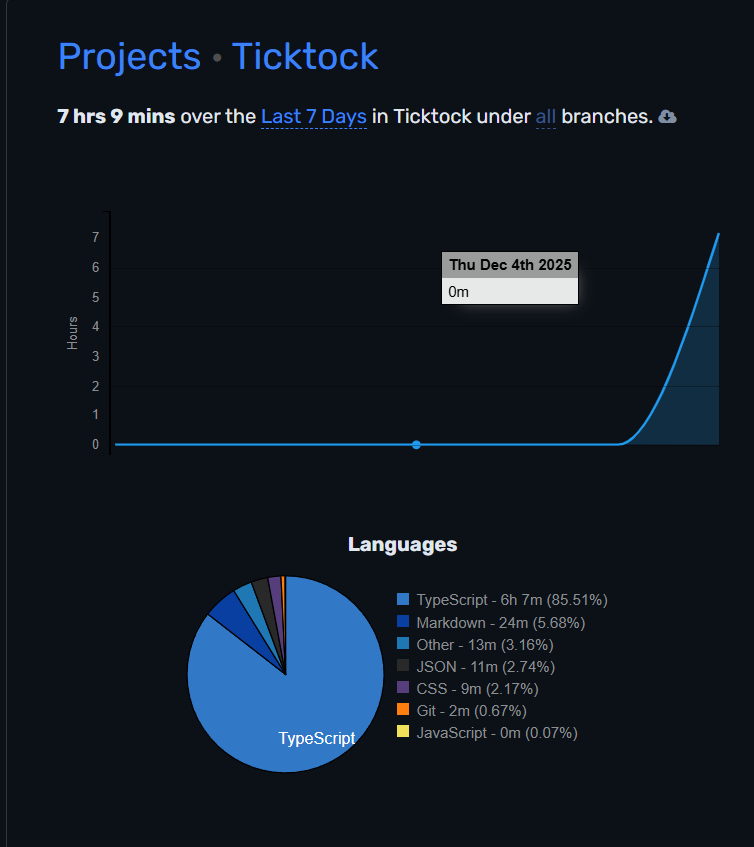

# Ticktock

Timesheet dashboard built with Next.js 15 (App Router), React 19, and TailwindCSS.

## Setup

- Requirements: Node.js 20+ and npm.
- Install dependencies: `npm install`.
- Create `.env.local` with:
  - `AUTH_SECRET=change-me`
  - `NEXTAUTH_URL=http://localhost:3000`
- Run the dev server: `npm run dev` (http://localhost:3000).
- Production build/start: `npm run build` then `npm start`.
- Quality checks: `npm run lint` (ESLint) and `npm run test` (Vitest + Testing Library).

## Frameworks & libraries

- Next.js 15 App Router, React 19, TypeScript
- TailwindCSS 3 + tailwindcss-animate
- shadcn/ui primitives (Radix-based) in `src/components/ui`
- NextAuth credentials provider
- TanStack Query for data fetching/cache
- React Hook Form + Zod for forms/validation
- date-fns and react-day-picker for dates; lucide-react icons
- Vitest + Testing Library for unit/component tests

## Assumptions & notes

- Authentication is a credentials flow: any email with password `password`. “Remember me” sets session to 30 days; unchecked is 12 hours. Protected routes are enforced via NextAuth middleware.
- Data is mocked/in-memory (`src/lib/mock-data.ts`) and exposed through Next.js API routes; no external database or persistence.
- UI components follow shadcn/ui conventions; add new primitives with `npx shadcn@latest add <component>` using `components.json`.
- Seeded timesheet weeks are 2026-dated sample data intended for UI/demo use.

## Time spent (7 hours 9 mins)

